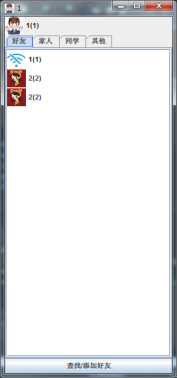
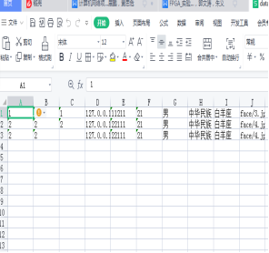

# 基于Java socket的局域网TCP/UDP通信系统

>本系统是基于局域网的TCP/UDP通信系统，暂存许多bug，还需继续维护

```cpp
//1. QQ_Socket:是实现客户端的Java项目，能够在局域网下与服务器端通信，客户端之间也能通信

//2. TCP_Socket：是实现服务器端的Java server，能够给客户端返回数据，担任数据中心的角色

//3. image.png和image22.png是本项目的部分截图，便于直接查看实现效果

//4. readme.md是markdown文件，是对本项目实现的功能和目的介绍

//5. 使用教程.txt是用户使用本项目的一些注意事项和教程
```

### 实现效果


1、socket:socket叫套接字，由IP地址和端口号共同组成。每一条TCP
连接唯一地被通信两端的两个端点即两个套接字所确定，形如：


2、端口号：即协议端口号，通常简称为端口(port)，通信的终点是应用
进程，可以通过把端口想象成为通信的终点，因为只需要把传送的报文交到目的主机的某一个合适的目的端口，剩下的工作即最后交付目的进程就由TCP完成。在协议栈层间的抽象的协议端口是软件端口，而硬件端口是不同硬件设备进行交互的端口，而软件端口是应用层的各种协议进程与传输实体进行层间交互的一种地址。端口用一个16位端口号进行标志，只具有本地意义，即端口号只是为了标志本计算机应用层中的各进程；在互联网中，不同计算机的相同端口号没有联系。因此两台计算机中的进程要相互通信，不仅需要知道对方的IP地址以找到对方计算机，而且还要知道对方的端口号以找到对方计算机中的应用进程。

3、TCP：即传输控制协议，传送的数据单位协议是TCP报文段，是一
种面向连接的协议，提供面向连接的服务，传送的数据单位协议是TCP报文段，不提供广播或多播服务；由于TCP要提供可靠的、面向连接的传输服务，因此不可避免地增加了许多的开销，这不仅使协议数据单元的首部增大很多，还要占用许多的处理及资源。TCP报文段是在传输层抽象的端到端逻辑信道中传送，是可靠的全双工信道。但这样的信道却不知道究竟经过了那些路由器，而这些路由器也根本不知道上面的传输层是否建立了TCP连接。

4、UDP：即用户数据报协议，传输的数据单位协议是用户数据报，是
一种无连接协议，在传输数据之前不需要先建立连接，传送的数据单位协议是UDP报文或用户数据报；对方的传输层在收到UDP报文后不需要给出任何确认，虽然UDP不提供可靠交付，但在某些情况下UDP是一种最有效的工作方式。UDP用户数据包与网络层的IP数据报有很大差别主要是IP数据报要经过互联网中许多路由器的存储转发，UDP用户数据包是在传输层的端到端抽象的逻辑信道中传送的。

5、注意：UDP传输是基于报文的，而TCP传输是面向字节流的，其中
TCP的字节流中的“流”是指流入或流出进程的字节序列，面向字节流的含义是虽然应用程序和TCP的交互是一次一个数据块，但TCP把应用程序交下来的数据看成仅仅是一连串无结构的字节流。

### 实现
1、因为目前还没有直接连接公网IP的功能，我们采用的是基于局域
网的聊天系统。其中通过连接同一个路由器（本次使用一个手机移动热点作为无线路由器），客户端和服务端都连接至此局域网以实现物理组网。
2、我们对系统的设计为：客户端各个端既是服务器又是客户机，即
客户端之间可以直接收发消息和传输文件，实现的一个端到端的系统；与此同时，为了解决客户之间需要寻找陌生用户和与陌生用户建立通信的需求，我们搭建了一个服务器，供客户端访问服务端获得陌生人信息，服务器下发信息到客户端。客户端之间的通信我们使用的是面向无连接的UDP通信，而客户机与服务器之间的通信我们使用的是面向连接的TCP通信，建立的逻辑框图如下：


    

3、我们采用的开发语言是Java程序设计语言，其中用于实现UDP通
信的算法，如下所示：


如图所示，实现的是UDP的通信连接请求发送过程，标号1是我们实现的一个序列化类，用于存储需要发送的信息如文本，文件等等；标号2是通过InetAddress来设置需要连接的用户的IP地址，通过获得port来设置对方的软件端口，并通过socket发送出去，用户接受的程序实现如下：


其中通过获取输入流并解析就可以得到传输的内容。同理，基于TCP通信的发送请求和接受内容实现如下所示（以访问服务器为例）：


我们采用的序列化发送类如下所示，其中Cmd是指自定义的一些识别代码，例如以1024代表的是发送文本，对方接受到内容并解析得到Cmd是1024后就知道要接受文本；还分别存储了己方账号和对方账号，便于双方知道通信双方的信息；其余变量类似，即存储文件或文件名以及存储发送的字节等等，最后一个向量存储的是访问服务器后得到的用户信息。


服务端因为要访问来自用户的访问，所以必须要实现多线程通信，所以我们加入了多线程编程（客户端也实现了），每个用户访问服务器都会启动一个线程来响应，线程体实现如下：


完成基本的框架搭建之后，为了增加系统的可视化性，增加了UI设计，提高用户使用体验感，便于用户直接使用；同时，由于系统需要存储用户信息避免再次返回系统时好友信息丢失，我们采用文件存储的方式来是实现数据持久化，即将用户（好友）数据保存于文件中，通过读写文件实现数据保存，实现效果如下含文件表：（以好友列表为例）




